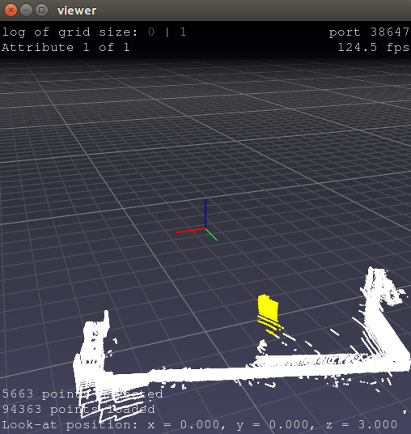

# LiDAR and Camera Calibration
ROS package for LiDAR and camera calibration.
Partially borrowed from [heethesh/lidar_camera_calibration](https://github.com/heethesh/lidar_camera_calibration)

## 一、安装及编译:
```
# cd to the source directory of a catkin workspace
git clone https://github.com/Dysonsun/lidar_camera_calibration.git
pip install -r lidar_camera_calibration/requirements.txt
cd ..
catkin build
```

## 二、运行vehicle_frame

### 1. 激光雷达和相机的联合标定

```
source ./devel/setup.zsh
rosrun lidar_camera_calibration calibrate_camera_lidar_main.py --calibrate \
        --image_topic XXX --pointcloud_topic XXX \
        --chessboard_size 7x9 --square_size 0.12 --lidar_points 500]
```


1. 播放对应的rosbag包
2. 按下回车【ENTER】,开始自动寻找棋盘格角点
   - 自动寻找寻找角点成功：
   <center>

   

   </center>
    按回车【ENTER】或自动等待30秒，退出显示界面

   - 自动寻找角点不成功：
    <center>

     
    </center>
    点击鼠标左键，框选整个棋盘格，然后按回车【ENTER】，此时算法会在框选的区域自动寻找棋盘格角点，如果还是找不到角点，则回到步骤2。

   - 自动寻找角点还是不成功，需要手动选取角点
    手动点击鼠标左键，选取棋盘格上的点，顺序为：左上、右上、右下、左下。选取了四个点，按下【Y】键确认，如果选取错误，则按下【S】或者【Q】退出选取。


   - 角点寻找错误：
    当发现棋盘格角点检测错误时，应该按下【Q】舍弃这一帧的数据，同时回到步骤2.

3. 选取点云平面
    - 按下【CTRL】键的同时点击鼠标左键选定标定板区域，按下回车【ENTER】
   <center>

    
        
   </center>

    - 查看平面拟合结果，如果看到红色的圆点全部位于标定板平面内，则说明拟合平面成功，按下回车【ENTER】,这样一帧数据就标完了。
   
    <center>

    
           
    </center>

4. 舍去上一帧的数据

    如果觉得上一帧标的数据不满意，可以在终端输入【l】,然后按下回车【ENTER】，就可以丢弃上一帧的数据。

5. 展示标定结果
   
   ```
   rosrun lidar_camera_calibration calibrate_camera_lidar.py --project \
   --image_topic XXX --pointcloud_topic XXX 
   ```
